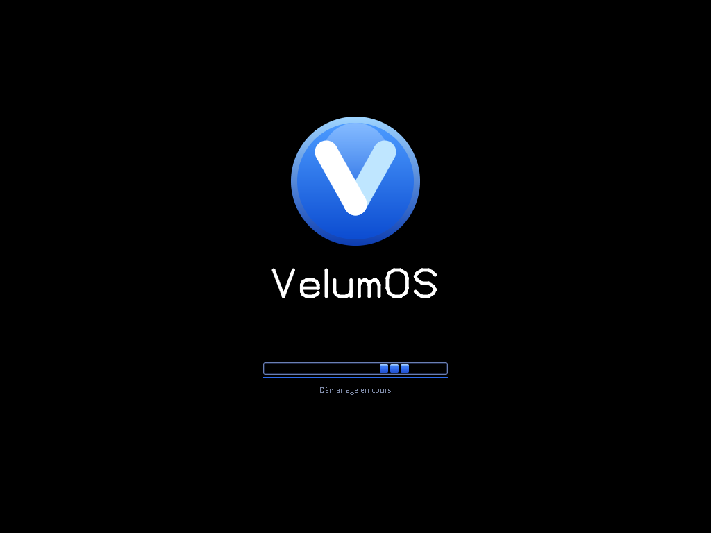
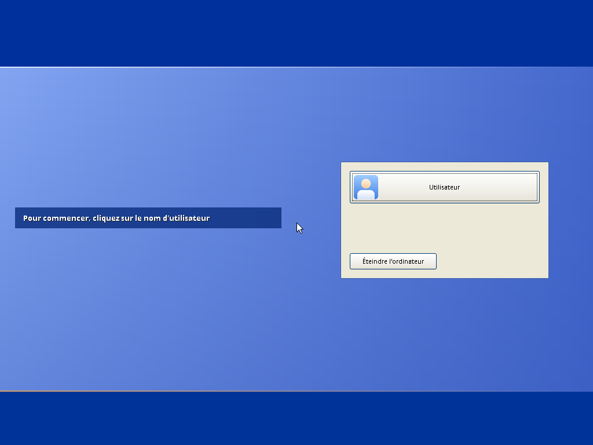
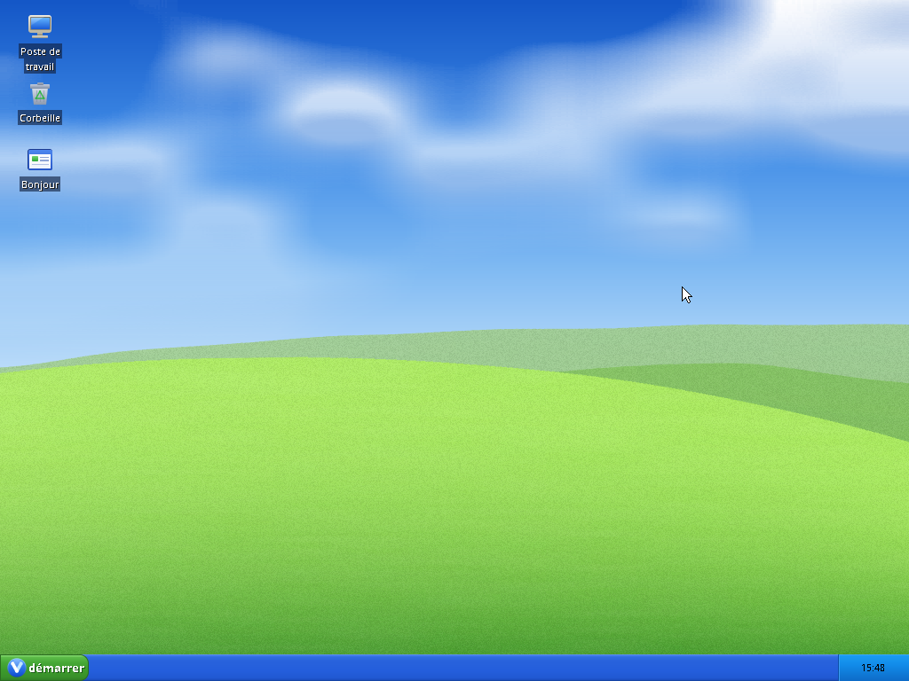
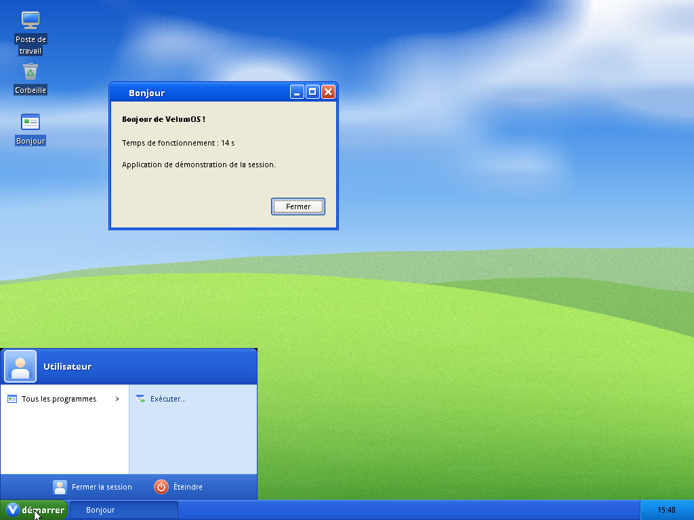
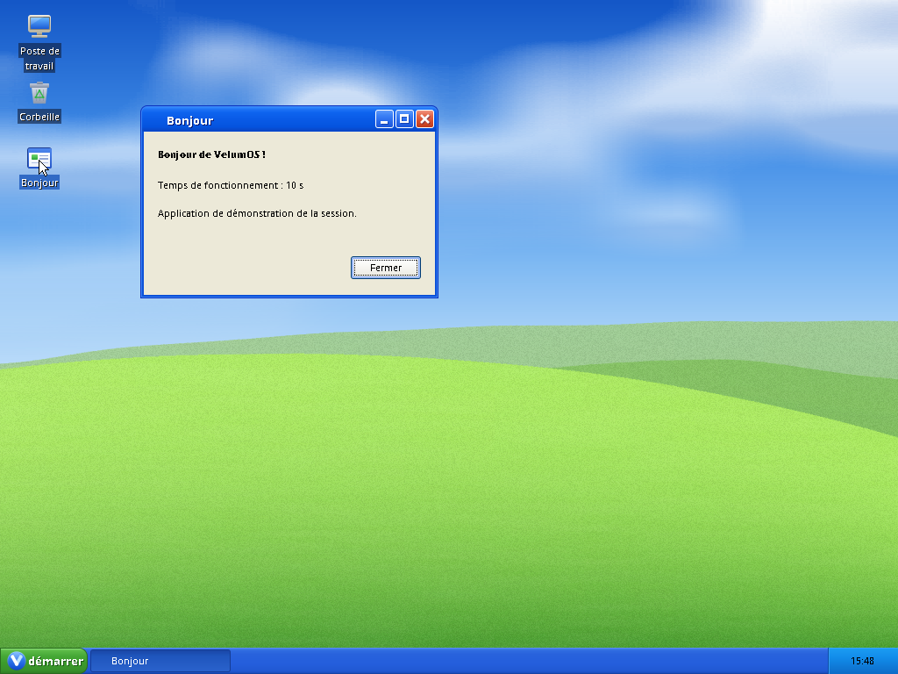

# VelumOS

VelumOS est un système d'exploitation écrit de zéro, en C, pour x86-64. Cette édition (« win32 ») reproduit
l'expérience de bureau de Windows XP : démarrage, ouverture de session, thème Luna, barre des tâches, menu
Démarrer. Le nom désigne le style de l'interface. Le noyau n'a rien de commun avec celui de Windows et il
n'exécute pas de programmes Windows. Aucune ligne de code, aucun fichier,
aucune image, aucune police de Microsoft n'y est utilisé : les dimensions viennent de la documentation
publique de l'interface, les dessins sont générés par du code écrit ici.

Les priorités du projet, dans l'ordre : sécurité, stabilité, rapidité, faible consommation de ressources.

Le dépôt documente aussi sa campagne de tests, de l'unité à la machine virtuelle complète : voir
[Campagne de tests](#campagne-de-tests), [`TESTS.md`](TESTS.md) et [`tests/README.md`](tests/README.md).



| | |
|---|---|
|  |  |
|  |  |

Windows et Windows XP sont des marques de Microsoft Corporation. VelumOS n'est ni affilié à Microsoft
ni approuvé par elle, et il n'exécute pas de programmes Windows.

## Table des matières

1. [État du projet](#état-du-projet)
2. [Campagne de tests](#campagne-de-tests)
3. [Démarrage rapide](#démarrage-rapide)
4. [Commandes](#commandes)
5. [Architecture](#architecture)
6. [Du clic à l'écran](#du-clic-à-lécran)
7. [Décisions de conception](#décisions-de-conception)
8. [Organisation du dépôt](#organisation-du-dépôt)
9. [Conventions de code](#conventions-de-code)
10. [Limites connues](#limites-connues)
11. [Composants tiers et licence](#composants-tiers-et-licence)

## État du projet

C'est un prototype. La première tranche fonctionnelle est complète : un noyau durci, des processus
isolés en anneau 3, un serveur de fenêtres et une session de bureau qui démarrent sous QEMU en BIOS
et en UEFI. Rien n'a été essayé sur une vraie machine.

Ce qui fonctionne :

- démarrage par Limine (BIOS et UEFI), noyau en higher half, écran de démarrage avec barre de progression ;
- mémoire physique, mémoire virtuelle avec W^X et NX, tas noyau, copies utilisateur sans faute possible ;
- ordonnanceur préemptif à 32 priorités, verrous, mutex, événements, minuteries sans tic périodique ;
- ACPI (tables, extinction S5), APIC local et IOAPIC, TSC, HPET, RTC ;
- processus en anneau 3 (ELF64 PIE à base aléatoire), appels système, handles, canaux de messages,
  sections de mémoire partagée ;
- PCI (ECAM et ports), MSI, générateur aléatoire ChaCha20, SHA-256, HMAC et PBKDF2 ;
- clavier et souris PS/2 (dispositions AZERTY et QWERTY), disques virtio-blk, partitions GPT et MBR ;
- VFS avec initrd cpio et FAT32 en lecture et écriture (l'écriture n'est éprouvée que sur des disques simulés) ;
- framebuffer, console noyau, écran d'arrêt, changement de mode sur l'adaptateur Bochs/QEMU ;
- moteur de dessin 2D, polices bitmap UTF-8, thème Luna, serveur de fenêtres, bibliothèque de contrôles ;
- écran de connexion avec mot de passe haché, bureau, barre des tâches, menu Démarrer, extinction.

Ce qui manque est détaillé dans [Limites connues](#limites-connues).

En chiffres (C, en-têtes et assembleur) :

| Partie | Lignes | Fichiers |
|--------|--------|----------|
| noyau portable (`kernel/`) | 20 800 | 318 |
| code propre à l'architecture (`arch/`) | 4 900 | 75 |
| pilotes (`drivers/`) | 6 000 | 99 |
| systèmes de fichiers (`fs/`) | 5 500 | 71 |
| bibliothèques partagées (`lib/` : dessin, polices, thème, fenêtres, contrôles, crypto) | 14 100 | 212 |
| libc et applis utilisateur (`user/`) | 11 800 | 239 |
| en-têtes publics (`include/`) | 2 300 | 41 |
| tests unitaires (`tests/host/`) | 64 500 | 971 |

Python (outils et scénarios système) : 3 400 lignes.

## Campagne de tests

Ce dépôt est aussi le support d'une campagne de tests menée à l'échelle d'un système d'exploitation : du test
unitaire d'une fonction du noyau jusqu'au scénario qui démarre une machine virtuelle et clique dans le bureau.
Le rapport complet (stratégie, techniques, résultats par sous-système, mesures, registre des défauts, limites) est
dans [`TESTS.md`](TESTS.md). Le code de test et sa façon de s'écrire sont décrits dans
[`tests/README.md`](tests/README.md).

### En bref

| Mesure (5 octobre 2026) | Résultat |
|-------------------------|----------|
| Niveaux de test | 4 : unitaire sur l'hôte, autotests du noyau, scénarios système QEMU, contrôles statiques |
| Couverture fonctionnelle automatisée | **90,2 %** des 82 fonctionnalités vérifiables (78,0 % entièrement automatisées, 12,2 % avec un complément manuel) |
| Couverture manuelle seule | **9,8 %** (8 fonctionnalités), plus 21 cas de test manuels décrits dans [`tests/MANUEL.md`](tests/MANUEL.md) |
| Tests unitaires | environ 530 exécutions de suites, 13,19 millions de vérifications, 0 échec (ASan et UBSan) |
| Scénarios système | 81 exécutions sur 81 (42 scénarios, BIOS et UEFI) |
| Autotests du noyau | 17 sur 17 |
| Défauts trouvés et corrigés | 37 : 23 dans le produit (6 de gravité haute, 10 moyenne, 7 basse) et 14 dans l'infrastructure de test |
| Couverture mesurée avec gcov | de 95 % à 100 % des lignes sur les sous-systèmes mesurés (a01, a02, a03, a08, a11, a13, a16) |
| Test de mutation | mémoire physique (41 mutants définis, 31 joués), affichage (12), polices (22) |
| Contrôles statiques | norminette sur 1 993 fichiers, en-têtes autonomes, contrôle de fonctions dangereuses, ruff, shellcheck : 0 erreur |

### Automatisé et manuel

Le principe : tout ce qui a un oracle automatique est automatisé, et seul ce qui demande un jugement humain, un
vrai périphérique ou une durée longue reste manuel. La mesure est faite sur les fonctionnalités vérifiables du système
(82, regroupées par sous-système), pas sur le nombre de tests : chaque fonctionnalité a un mode de vérification et la
liste des tests qui la couvrent.

| Mode | Fonctionnalités | Part |
|------|-----------------|------|
| A : automatisé | 64 | 78,0 % |
| AM : automatisé, avec un complément manuel (aspect visuel, ergonomie, vrai clavier) | 10 | 12,2 % |
| M : manuel seulement | 8 | 9,8 % |

La couverture automatisée est donc de 90,2 % (A et AM), et 22,0 % des fonctionnalités appellent au moins un test
manuel. Par nombre de cas, 1 588 cas sont automatisés (cas unitaires nommés, scénarios QEMU, tests Python) contre 21
manuels, soit 98,7 % : ce second taux est beaucoup plus élevé parce que les cas automatisés sont fins, c'est le taux
fonctionnel qu'il faut retenir.

Ce qui reste en manuel : fidélité visuelle au style Luna, netteté des polices, manipulation des fenêtres à la souris,
saisie au clavier réel (touches mortes), redémarrage ACPI, matériel réel, endurance, performance perçue, revue
linguistique, FAT32 sur une image réelle, reproduction de la construction sur une machine propre. Chaque cas a ses
étapes et son résultat attendu dans [`tests/MANUEL.md`](tests/MANUEL.md).

Les taux ne sont pas écrits à la main : `make matrice` les recalcule depuis [`tests/matrice.toml`](tests/matrice.toml)
et vérifie que chaque test cité existe. Le détail par sous-système et par fonctionnalité est dans
[`tests/MATRICE.md`](tests/MATRICE.md).

Statut des cas manuels : aucun n'a encore été exécuté par une personne en session interactive. Trois ont été relus sur
des captures d'écran produites par les scénarios (écran de démarrage, lisibilité des polices, contraste), un est partiel
(construction : chaîne d'outils et image reconstruites, mais pas sur une machine vierge), dix-sept restent à exécuter.

### Stratégie fondée sur les risques

Les risques d'un noyau décident des techniques et de la profondeur : entrées hostiles (ELF, cpio, FAT32, ACPI, PCI,
messages d'un client graphique, arguments d'appel système), mémoire (fuites, double libération, aliasing de cache),
concurrence (verrous, attentes, messages), matériel (APIC, 8042, virtio), gel ou famine (préemption, arrêt d'un
processus), interface (rendu, zones de clic, focus). Chaque risque a une réponse de test (corpus corrompus et fuzz,
modèle de référence, injection d'échec, simulation de courses, scénarios système).

Critères de fin écrits avant l'exécution : chaque sous-système vert (compilation, tests unitaires, norme) ; le noyau
complet démarre en BIOS et en UEFI et passe ses autotests ; tous les scénarios passent dans les deux firmwares ; zéro
erreur statique ; aucun défaut de gravité haute ouvert. Ils sont atteints, avec les réserves de couverture données
dans `TESTS.md`.

### Techniques, avec un exemple réel de chacune

| Technique | Exemple dans le dépôt |
|-----------|-----------------------|
| Partitions et valeurs limites | `tests/host/skel/test_fmt.c` : le `printf` du noyau (drapeaux, largeur, précision, 64 bits, troncature avec une taille de 0 et de 1, zéro) ; adresses 0, 4095 et dernière page utilisateur pour la mémoire virtuelle |
| Corpus corrompus et fuzz par mutation | `tests/host/a07/test_elf_fuzz.c` : 6 000 ELF valides altérés (bits retournés, champs réécrits, octets de segment modifiés) plus une troncature à chaque taille. 4 890 refusés, 1 110 acceptés, et chaque ELF accepté doit respecter des invariants : segments dans la plage utilisateur, sans chevauchement, jamais à la fois inscriptibles et exécutables, point d'entrée dans un segment exécutable, relocations contenues dans le fichier. Graine `0xa07c0de` affichée |
| Modèle de référence | `tests/host/a02/test_model.c` : 100 000 opérations aléatoires sur l'allocateur de pages comparées à un modèle bitmap indépendant ; la graine est affichée |
| Injection d'échec à chaque rang | `pmm_fail_after(n)` : le test de la mémoire virtuelle fait échouer l'allocation de pages à chacun des rangs d'une opération (8 pour une allocation, 4 pour un mappage) et vérifie qu'aucune frame ni table ne fuit ; la bibliothèque de contrôles fait échouer chaque allocation une fois (348 vérifications) |
| Test négatif au niveau système | `tests/qemu/a02_fault_double_free.py` : le noyau reçoit une libération invalide et doit paniquer avec le bon message sans que l'autotest continue ; `a01_fault_stack.py` : une récursion infinie doit tomber sur la double faute avec sa pile dédiée, pas en triple faute |
| Preuve par différence | `tests/qemu/int_preempt.py` : un processus qui boucle ne doit pas geler la machine. Sans les deux correctifs, le test échoue au bout de 30 s ; avec eux, il passe en moins d'une demi-seconde |
| Test de mutation | `tests/host/a02/mutation.py` : 41 mutants du code (`g_pmm.hint = c + n;` devient `g_pmm.hint = c;`) joués en parallèle contre la suite. 28 tués sur les 31 joués au premier passage, et chacun des 3 survivants a donné un cas de test |
| Comparaison dos à dos | UTF-8 contre CPython (10 365 120 séquences, 0 écart), PBKDF2 contre `hashlib`, SHA-256 contre les vecteurs NIST, partitions GPT relues par `sgdisk -v`, mélange de pixels contre un calcul exact (16,7 millions de triplets) |
| Table de décision | focus clavier des contrôles (13 règles), partition des zones d'une fenêtre : chaque pixel appartient à une seule zone (`luna_hit_test`, trois tailles) |
| Vérification visuelle | `tests/qemu/a13_panic.py` : une capture de l'écran d'arrêt doit contenir plus de 80 % de pixels de la couleur attendue ; les captures de ce README servent de preuve de parcours |
| Statique | norminette, en-têtes publics compilés seuls, `make scan` (fonctions dangereuses, secrets), ruff, shellcheck |

### Traçabilité

La chaîne est : base de test (spécification du matériel, de la norme ou de l'ABI) vers modèle de test (partitions, table
de décision, états, grammaire) vers éléments de couverture vers cas de test. Le nom d'un cas porte la technique et
l'élément, par exemple `v_spawnv/exigence : chemin, blob, longueur, flags` ou `v_spawnv/injection de panne : VALLOC
refuse`, et les sections de `TESTS.md` relient chaque sous-système à ses techniques.

### Défauts trouvés

| Gravité | Nombre | Exemples |
|---------|--------|----------|
| Haute | 6 | processus qui boucle en anneau 3 sans préemption (gel de la machine), processus tué qui survit, #GP noyau quand un espace d'adressage est détruit avant son dernier fil, allocateur utilisateur qui prend une adresse valide pour une double libération, `ET_EXEC` à l'adresse 0 au lieu de `ET_DYN`, copie de pixels qui ignore la ligne de départ |
| Moyenne | 10 | `printf` qui n'écrit aucun chiffre pour 0, lecture au-delà d'une chaîne non terminée avec `%.3s`, deux types de cache sur une même page, recherche de nom insensible à la casse limitée à l'ASCII |
| Basse | 7 | texte tronqué sur le bouton Démarrer, débordements de mise en page d'un pixel, touche Maj qui sélectionne une icône |

Classement indicatif du niveau où chaque défaut est apparu en premier : 15 aux tests unitaires, 4 en scénario système
(démarrage et préemption), 4 à l'intégration (lecture du journal, inspection de l'ELF, captures d'écran).

### Trois histoires

**Un zéro qui disparaît.** Au premier démarrage du noyau complet dans QEMU, la ligne finale affichait `SELFTESTS PASS `
sans nombre et tous les horodatages du journal étaient vides. Le `printf` du noyau n'écrivait aucun chiffre pour la
valeur 0. Le module avait des tests, mais la partition « valeur nulle » n'y figurait pas : le cas a été ajouté à
`test_fmt.c` avant la correction et reste comme test de régression.

**Un processus qui gèle la machine.** Les tests unitaires de l'ordonnanceur, ses autotests et tous les scénarios
passaient. Mais personne n'appelait la préemption au retour d'une interruption, et rien n'exerçait un processus qui
calcule sans jamais appeler le noyau. Écrire le scénario d'intégration (un fil qui dort pendant que l'autre boucle, puis
un processus qui boucle et qui doit pouvoir être tué) a mis au jour deux défauts de jonction entre sous-systèmes.
Retirer volontairement les correctifs fait échouer le scénario : le test détecte bien ce qu'il prétend détecter.

**Une souris qui n'arrive jamais.** Un scénario de clic échouait systématiquement alors que le pilote était correct.
Le journal des événements (`inputlog`) montrait que les totaux de déplacement étaient conservés mais fusionnés : QEMU
regroupe les mouvements envoyés trop vite, et le déplacement net, négatif, était borné au coin de l'écran par le
serveur de fenêtres, si bien que la remontée prévue par le scénario n'existait plus. Le défaut était dans l'hypothèse
du test, pas dans le produit. Correction : espacer les mouvements.

### Instabilités

| Symptôme | Cause | Traitement |
|----------|-------|------------|
| faux échec sur `PANIC:` | le journal est lu pendant l'écriture de la ligne | pas d'échec si le motif attendu contient lui-même `PANIC` |
| résultat périmé | image mise en cache, non reconstruite quand seul l'initrd change | la date de l'initrd entre dans la décision |
| `[TEST] x ... OK` introuvable | les journaux du test s'intercalent avant le `OK` | la ligne de résultat est écrite en entier sur sa propre ligne |
| seuil de convoi dépassé | le seuil dépendait du nombre de cœurs de l'hôte | seuil indépendant du parallélisme |
| autotests de temps en échec | plusieurs machines QEMU en parallèle sur le même hôte | durées et tolérances à lire avec la charge de la machine |

### Limites et risques résiduels

- Pas de vérification sur du vrai matériel, un seul processeur, aucune mesure de performance en profil release.
- Les 21 cas manuels sont décrits mais pas exécutés en session interactive.
- Couverture non mesurée pour plusieurs sous-systèmes ; mutation partielle ; dix tests du système de fichiers à
  découper pour respecter la norme, et pas de scénario système pour l'écriture FAT32.
- Les tests de durée (équité, sommeil) restent sensibles à la charge de l'hôte.

Le détail, sous-système par sous-système, figure dans [`TESTS.md`](TESTS.md).

### Rejouer la campagne

```
make test-qemu          tous les scénarios, BIOS et UEFI (environ 3 minutes)
make -j8 -k test-host   tous les tests unitaires (plus de 10 minutes la première fois)
make test-tools         tests des outils Python
make matrice            recalcule les taux de couverture automatisée et manuelle
make norme hdrcheck scan   contrôles statiques
```

Les captures de ce fichier sont produites par `tests/qemu/int_captures.py` et `tests/qemu/int_demarrage.py`.

## Démarrage rapide

### Prérequis

| Outil | Rôle | Version testée |
|-------|------|----------------|
| `x86_64-elf-gcc` et binutils | compilateur croisé du noyau et des applis | gcc 15.3.0, binutils 2.47 |
| GNU make, un `gcc` hôte | construction, tests unitaires (ASan et UBSan) | gcc 16.2 |
| Python 3 | outils de construction et de test | 3.14 |
| `sgdisk` (paquet gdisk) et mtools | fabrication de l'image disque | |
| `curl`, `tar`, `sha256sum` | téléchargement vérifié de Limine | |
| QEMU et OVMF (edk2) | exécution et tests système | QEMU 10.2.2 |

Facultatifs : `norminette` (contrôle de la norme de code), `ruff`, `shellcheck`, `shfmt`, Pillow
(captures PNG et génération des polices), `pytest`.

Sous Fedora : `sudo dnf install gcc make python3 gdisk mtools qemu-system-x86 edk2-ovmf curl`.
Sous Debian et Ubuntu : `sudo apt install build-essential python3 gdisk mtools qemu-system-x86 ovmf curl xz-utils`.

### Compilateur croisé

Le noyau se lie avec `libgcc`. Elle doit exister en variante `-mno-red-zone` : une interruption écraserait
sinon les 128 octets sous la pile. Le script suivant construit binutils et gcc avec cette variante, à partir
de sources dont les empreintes sont figées (environ une demi-heure sur 8 cœurs) :

```
tools/build-toolchain.sh
export PATH="$HOME/.local/opt/velum-cross/bin:$PATH"
```

Le préfixe d'installation se change avec `PREFIX=...`. Si le compilateur est déjà là sous un autre nom ou
ailleurs, `make CROSS=/chemin/vers/bin/x86_64-elf-` suffit. La procédure a été rejouée de bout en bout : le noyau
construit avec le compilateur obtenu démarre en BIOS et en UEFI.

### Construire et lancer

```
make limine        # télécharge Limine 12.9.1, vérifie son empreinte, compile son outil
make -j8 all       # noyau, applis, image disque dans build/main/debug/disk.img
make run           # fenêtre QEMU (KVM utilisé s'il est disponible)
make run-uefi      # même chose en UEFI
```

Au démarrage, cliquer sur le compte « Utilisateur » ouvre le bureau (le mot de passe est vide). Le port série
est branché sur le terminal : le journal du noyau y défile. Pour garder la console noyau à l'écran, ajouter
`CMDLINE="verbose init=/aucun"`.

## Commandes

| Commande | Effet |
|----------|-------|
| `make limine` | prépare le chargeur (téléchargement vérifié par sha256) |
| `make all` | noyau, applis utilisateur, image disque (`PROFIL=release` pour le profil sans UBSan) |
| `make run`, `make run-uefi` | lance l'image dans QEMU |
| `make test-qemu` | tous les scénarios système, BIOS et UEFI |
| `make test-host` | tests unitaires de tous les sous-systèmes (long la première fois) |
| `make test-tools` | tests des outils Python (image disque), nécessite `pytest` |
| `make B=build/a03 lot LOT=a03` | compile, teste et contrôle la norme d'un seul sous-système |
| `make norme` | norminette sur tout le C |
| `make scan` | contrôle statique de sécurité (fonctions C dangereuses, secrets, idiomes risqués) |
| `make hdrcheck` | vérifie que chaque en-tête public se compile seul |
| `make test` | norme, outils, tests hôte, scénarios QEMU |
| `make help` | rappel des cibles |

Variables utiles : `B` (dossier de build, un par personne ou par tâche), `PROFIL` (`debug` par défaut),
`CMDLINE` (ligne de commande du noyau), `MODE` (résolution, `1024x768`), `ONLY` (ne lier que certains
sous-systèmes), `CROSS`, `OVMF_CODE` et `OVMF_VARS`.

## Architecture

### Vue d'ensemble

```
 applis (logon, shell, hello, ...)      mode utilisateur, ELF64 PIE, une adresse de base par lancement
   |  libwm (messages)        |  libctl (contrôles)  |  libluna, libfont, libgfx (dessin)
 winsrv : composition, ordre Z, focus, souris, protocole de fenêtres
   |  libvelum : appels système, libc minimale, fils, mutex
 ------------------------------------------------------------- syscall / sysret, anneau 3 <-> anneau 0
 noyau : processus, objets et handles, canaux, sections, VFS, ordonnanceur, mémoire, pilotes
 Limine (BIOS ou UEFI) : charge le noyau et l'initrd, donne la carte mémoire et le framebuffer
```

Le noyau garde ce qui doit rester en anneau 0 : mémoire, ordonnancement, pilotes, VFS. Tout ce qui est
applicatif, interface graphique comprise, tourne en anneau 3. Le seul dessin du noyau est l'écran de
démarrage, la console de secours et l'écran d'arrêt.

### Séquence de démarrage

`_start` pose la pile et un canari aléatoire, puis `kmain` collecte les informations du chargeur et lance
les étapes suivantes dans cet ordre. Une étape absente est ignorée (symbole faible), ce qui permet de lier
un sous-ensemble du noyau pour les tests.

| Étape | Rôle |
|-------|------|
| cpu | GDT, TSS avec piles dédiées pour #DF, NMI et #MC, IDT, CPUID, SSE et XSAVE, SMEP, SMAP, UMIP |
| pmm | mémoire physique : bitmap et propriétaire par frame |
| vmm | tables de pages noyau, W^X, NX, bascule de CR3, récupération de la mémoire du chargeur |
| heap | tas à dalles, compteurs par propriétaire |
| display | framebuffer en écriture combinée, console, écran de démarrage |
| acpi, irq, timer | tables ACPI, APIC et IOAPIC, TSC, HPET, RTC, minuteries |
| sched | ordonnanceur, fil d'inactivité, activation des interruptions |
| syscall, object, proc | entrée `syscall`, objets et handles, chargeur ELF |
| random, pci | générateur aléatoire, énumération PCI |
| input, block, vfs | clavier et souris, disques, systèmes de fichiers |

Puis les autotests (option `selftest` de la ligne de commande), et `init` (`/system/bin/init`) qui lance
le serveur de fenêtres puis l'écran de connexion, et les relance en cas de plantage.

### Carte de la mémoire virtuelle

| Région | Adresse | Taille |
|--------|---------|--------|
| utilisateur | `0x10000` à `0x00007ffffffff000` | 128 Tio |
| pile utilisateur | sous `0x00007fffffff0000`, page de garde dessous | 1 Mio |
| mémoire physique directe (HHDM) | donnée par le chargeur (`0xffff800000000000` par défaut) | RAM |
| tas noyau | `0xffffc00000000000` | 1 Tio |
| fenêtres MMIO | `0xffffd00000000000` | 1 Tio |
| piles noyau | `0xffffe00000000000`, 16 Kio et une garde par pile | 1 Tio |
| image du noyau | `0xffffffff80000000` | |

Aucune page n'est jamais à la fois inscriptible et exécutable. Le noyau lit et écrit la mémoire utilisateur
par le HHDM après avoir parcouru les tables : une copie ne peut donc pas provoquer de faute, et SMAP reste actif.

### Processus, isolation et privilèges

- Applis : ELF64 `ET_DYN` statiques, relocations `R_X86_64_RELATIVE` seulement, base tirée au hasard,
  alignée sur 2 Mio. Le chargeur valide tout (en-têtes, segments, chevauchements, W^X) et refuse le reste.
- Un processus ne voit le noyau qu'à travers des handles (entiers 32 bits avec génération). Chaque handle
  porte des droits (`HR_*`) qu'on ne peut que réduire en le dupliquant.
- Les privilèges (`PF_SPAWN`, `PF_DISPLAY`, `PF_INPUT`, `PF_LISTEN`, `PF_FSWRITE`, `PF_POWER`, `PF_ADMIN`)
  se transmettent par masque : un enfant n'a jamais plus que son parent. Seul le serveur de fenêtres
  reçoit l'affichage et l'entrée.
- Une faute en anneau 3 tue le processus, jamais le noyau. Un processus qui boucle est préempté et peut être tué.
- Durcissement du noyau : canari de pile, variables locales initialisées à zéro, registres effacés au
  retour, UBSan en piège dans le profil debug, journal limité en débit par processus, aucune panique sur une
  entrée venue d'une appli. Les applis sont liées avec RELRO et sans segment à la fois inscriptible et exécutable.

### Appels système (ABI version 1)

Instruction `syscall` : numéro dans `rax`, arguments dans `rdi`, `rsi`, `rdx`, `r10`, `r8`, `r9`, retour dans
`rax` (valeur positive ou nulle, ou code d'erreur négatif `E_*`). Les numéros ne sont jamais réutilisés.
La définition fait foi dans [`include/velum/abi/`](include/velum/abi/).

| Domaine | Numéros | Appels |
|---------|---------|--------|
| processus et fils | `0x00` à `0x0a` | sortie, lancement, arrêt, informations, fils, priorité, TLS, journal |
| objets et messages | `0x10` à `0x1f` | fermer, dupliquer, attendre (un ou plusieurs), événements, sections, ports, canaux, minuteries |
| fichiers | `0x30` à `0x3d` | ouvrir, lire, écrire, positionner, informations, répertoires, créer, supprimer, renommer |
| temps et énergie | `0x50` à `0x58` | céder, dormir, horloges, extinction et redémarrage |
| affichage | `0x60` à `0x64` | informations, mappage du framebuffer, modes, console noyau |
| entrées | `0x70` à `0x74` | ouvrir, lire, disposition, voyants, souris |
| divers | `0x80`, `0x81` | aléatoire, informations système |
| mémoire virtuelle | `0xa0` à `0xa3` | allouer, libérer, protéger, interroger |

### Interface graphique

Tout est en mode utilisateur. Chaque fenêtre cliente possède une section partagée où elle dessine ses pixels
(XRGB8888). Le serveur `winsrv` dessine le cadre Luna, compose dans un tampon arrière et copie les zones
modifiées dans le framebuffer qu'il a mappé. Les clients lui parlent par un canal nommé avec des messages à taille
fixe, tous validés : un client qui envoie n'importe quoi est déconnecté. Le bureau et la barre des tâches sont de
simples fenêtres du shell avec des styles particuliers.

Le rendu 2D, les polices et le thème n'utilisent ni flottants ni allocations : le même code sert au noyau (écran de
démarrage) et aux applis. Les polices sont des bitmaps 1 bit générés à la construction depuis des polices libres
(voir [Composants tiers](#composants-tiers-et-licence)).

## Du clic à l'écran

Ce que traverse un clic sur le bouton Démarrer, du matériel au pixel :

1. La souris PS/2 émet un paquet de 3 ou 4 octets. L'IRQ 12 arrive par l'IOAPIC, le pilote vide le contrôleur
   8042, resynchronise le flux si un octet manque et pousse un événement dans une file circulaire.
2. `winsrv`, qui a ouvert l'entrée (`SYS_INPUT_OPEN`, privilège `PF_INPUT`), est réveillé par son `SYS_WAIT_MANY`,
   lit les événements, met à jour la position du curseur bornée à l'écran et cherche la fenêtre sous la souris.
3. `luna_hit_test` dit quelle zone de la fenêtre est visée (légende, bouton, bord, client). Pour la barre des
   tâches, c'est la zone cliente : le serveur transmet un message `WMS_MOUSE` au canal du shell, avec les
   coordonnées relatives à la fenêtre.
4. Le shell décide d'ouvrir le menu Démarrer : il crée une fenêtre popup (`WMC_CREATE`) et reçoit en réponse
   une section partagée dont le handle a traversé le canal.
5. Il mappe la section, dessine le menu dedans avec `libctl`, `libluna` et `libfont`, puis envoie `WMC_PRESENT`
   avec les rectangles modifiés.
6. `winsrv` recompose seulement les zones sales (cadre Luna, contenu de chaque fenêtre dans l'ordre Z, curseur)
   dans son tampon arrière et copie ces zones dans le framebuffer qu'il a mappé en écriture combinée.

Aucun de ces échanges ne passe par un appel système graphique : le noyau ne voit que des handles, des messages
et des pages partagées.

## Décisions de conception

| Décision | Raison | Alternative écartée |
|----------|--------|---------------------|
| Interface en anneau 3, composée par un serveur | un plantage du serveur ne tue pas le noyau, `init` le relance ; la surface d'attaque du noyau reste petite | graphisme dans le noyau (comme Win32k) |
| Handles à droits réductibles et génération | un handle volé ou réutilisé par erreur ne donne rien de plus que ce qu'on lui a accordé | descripteurs globaux sans droits |
| Copie utilisateur par le HHDM après parcours des tables | aucune faute possible pendant une copie, SMAP reste actif en permanence | ouvrir et refermer SMAP autour de chaque accès |
| Noyau sans flottants, 2D et polices sans allocation | le même code sert à l'écran de démarrage du noyau et aux applis | deux implémentations |
| Polices pré-rastérisées en bitmaps 1 bit | pas d'interpréteur de polices à l'exécution, rendu net et déterministe, 44 Kio de données | FreeType dans l'OS |
| Minuterie de l'échéance la plus proche, sans tic périodique | CPU au repos réellement au repos, une seule armature matérielle | tic à 100 ou 1 000 Hz |
| W^X strict et ASLR du chargeur | aucune page ne peut être écrite puis exécutée, la base de chaque appli change à chaque lancement | segments RWX, base fixe |
| Limine (téléchargé, empreinte vérifiée) | BIOS et UEFI avec un seul protocole, le dépôt ne redistribue pas de binaire | chargeur maison, GRUB |
| Aucun code tiers dans le noyau | maîtrise complète et licence unique ; les seules données tierces sont des polices libres | portage d'un noyau existant |
| Contrats par en-têtes publics et ABI versionnée | chaque sous-système se développe et se teste seul (`make lot LOT=aNN`) contre des faux conformes | dépendances croisées directes |

## Organisation du dépôt

```
arch/x86_64/    code propre à l'architecture : entrée, processeur, ACPI, APIC, horloges, bascule de contexte, syscall
kernel/         noyau portable : mm (pmm, vmm, tas), sched, proc, obj, time, irq, input, random, kcon
drivers/        pci, input (PS/2), block, virtio, display
fs/             VFS, initrd cpio, FAT32, appels système de fichiers
lib/            libk (chaînes et printf du noyau), crypto, gfx, font, luna, wm, ctl
user/           libvelum (appels système, libc, crt0), include, apps (init, winsrv, logon, shell, hello, ...)
include/velum/  en-têtes publics entre couches, dont abi/ pour l'interface avec les applis
mk/             fragments de Makefile : un par sous-système (lot-aNN.mk) et la mécanique commune
link/           script d'édition de liens du noyau
tools/          image disque, scénarios QEMU, contrôle de la norme, génération des polices, chaîne d'outils
tests/          host/ (tests unitaires par sous-système), qemu/ (scénarios système)
third_party/    en-tête du protocole Limine et polices sources
assets/         captures d'écran du README
```

Chaque sous-système a son fragment `mk/lot-aNN.mk` (sources, tests, applis) et s'isole avec
`make B=build/aNN lot LOT=aNN` :

| Lot | Sous-système | Lot | Sous-système |
|-----|--------------|-----|--------------|
| a01 | processeur, exceptions | a11 | disques virtio, partitions |
| a02 | mémoire physique | a12 | VFS, initrd, FAT32 |
| a03 | mémoire virtuelle | a13 | affichage, console noyau |
| a04 | tas noyau | a14 | libvelum, libc |
| a05 | ACPI, APIC, horloges | a15 | moteur de dessin |
| a06 | ordonnanceur, verrous | a16 | polices |
| a07 | appels système, processus, ELF | a17 | thème Luna |
| a08 | objets, canaux, sections | a18 | serveur de fenêtres |
| a09 | PCI, aléa, crypto | a19 | contrôles |
| a10 | clavier, souris | a20 | connexion, bureau |

Les en-têtes de `include/velum/` sont le contrat entre ces sous-systèmes : on peut y ajouter des déclarations,
jamais en retirer ni en changer le sens sans changer la version de l'ABI.

## Conventions de code

- C freestanding (`-std=gnu11`, aucune libc dans le noyau), compilé en `-Wall -Wextra -Werror`.
- Le C suit la norme de 42 et passe `norminette` : fonctions de 25 lignes au plus, 5 par fichier, 4 paramètres,
  80 colonnes, pas de `for`, `switch`, ternaire ni macro-fonction. L'assembleur (`.S`, syntaxe Intel) et
  `third_party/` en sont exemptés, ainsi que `arch/x86_64/limine/` (déclarations de requêtes du protocole,
  que la norminette refuse parce qu'elles utilisent des initialisations désignées).
- Pas de commentaires : les noms portent le sens.
- Types préfixés (`t_`, `s_`, `e_`), erreurs en entiers négatifs `E_*`, pointeurs utilisateur dans un type à part
  (`t_uptr`) qu'on n'ouvre que par `copy_from_user` et `copy_to_user`.
- Toute allocation peut échouer et son chemin d'échec est testé. Toute attente matérielle a un délai.
- Python : ruff. Shell : shellcheck et shfmt.
- Aucun code tiers, sauf une bibliothèque libre déclarée dans `third_party/` avec sa licence.

Pièges connus de `norminette` 3.3.60 sur du code noyau, avec leur contournement :

- l'assembleur en ligne avec des sorties et sans entrée contenant une variable déclenche un faux positif :
  mettre l'asm dans un fichier `.S` ;
- `typedef` interdit dans un `.c`, macros-fonctions interdites, initialisations désignées refusées ;
- les noms de toutes les globales d'un fichier doivent s'aligner sur la même colonne ;
- les prototypes d'un en-tête s'alignent sur une seule colonne : `tools/align_proto.py` le fait (on écrit
  `type§nom(args);` puis on lance l'outil) ;
- un littéral hexadécimal qui commence par `b` ou `B` est mal lu : écrire `0x0bb...`.

## Limites connues

- Un seul processeur : le démarrage des autres cœurs n'est pas écrit, les verrous sont prévus pour le SMP
  mais jamais éprouvés à plusieurs cœurs.
- Aucun essai sur du vrai matériel : tout tourne sous QEMU (q35 et pc, avec ou sans HPET).
- Pas d'USB (le clavier et la souris sont en PS/2), pas de réseau, pas de NVMe ni d'AHCI, un seul adaptateur
  graphique à mode réglable (Bochs/QEMU).
- Pas de compatibilité avec les programmes Windows.
- Le noyau monte une partition FAT32 sur `/data` si elle existe, mais l'image fournie n'en contient pas, et
  l'écriture FAT32 n'est testée que sur des disques simulés. Il n'y a ni récupération de mot de passe ni gestion
  de plusieurs comptes.
- Les dimensions « 1:1 » du thème sont tirées de la documentation publique et marquées incertaines à un pixel
  près pour quelques éléments (bouton Démarrer, zone de notification, entrées de menu).
- Quelques sous-systèmes n'ont pas leurs mesures de couverture ni leurs bancs de performance.

## Composants tiers et licence

Le code de ce dépôt est publié sous licence GNU GPL version 2 ou ultérieure (`GPL-2.0-or-later`),
texte dans [`LICENSE`](LICENSE). Le dépôt respecte la spécification REUSE : [`REUSE.toml`](REUSE.toml) déclare
la licence de chaque fichier et les textes sont dans [`LICENSES/`](LICENSES/).

| Composant | Où | Licence |
|-----------|----|---------|
| en-tête du protocole Limine | `third_party/limine/limine.h` | 0BSD |
| Open Sans 1.10 (Regular, Bold, ExtraBold) | `third_party/fonts/` | Apache-2.0 |
| Noto Sans Mono 2.014 | `third_party/fonts/` | SIL OFL 1.1 |
| bitmaps dérivés de ces polices | `lib/font/gen/` | GPL-2.0-or-later, plus Apache-2.0 ou OFL-1.1 selon la police |
| chargeur Limine 12.9.1 (BSD-2-Clause) | téléchargé par `make limine`, non redistribué | |

Les polices sources sont rasterisées par `tools/genfont.py` (Python et Pillow) ; la génération est reproductible
et les empreintes sont dans `lib/font/gen/MANIFEST`. Aucune police de Microsoft n'est utilisée.
